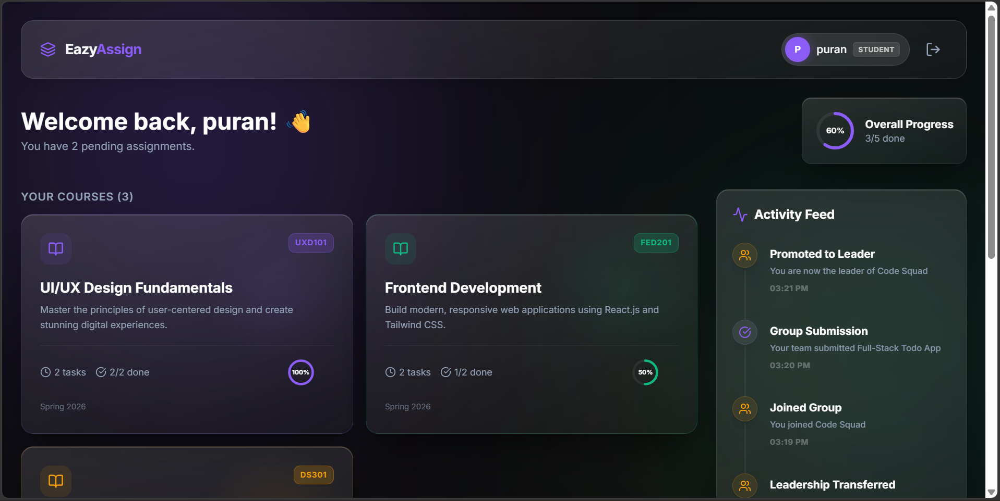
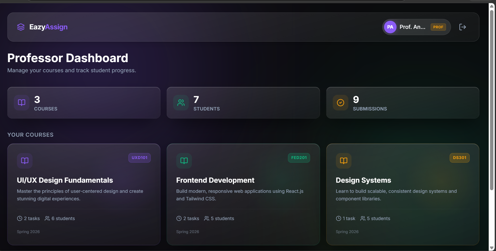
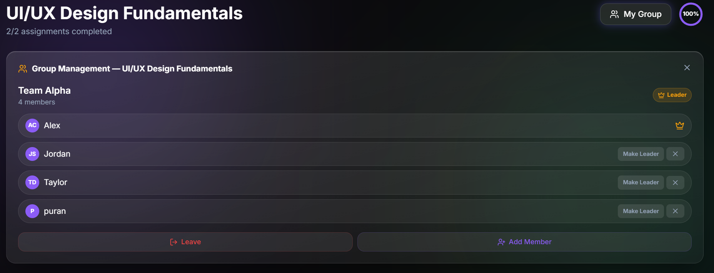
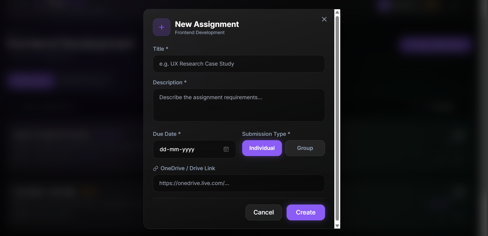
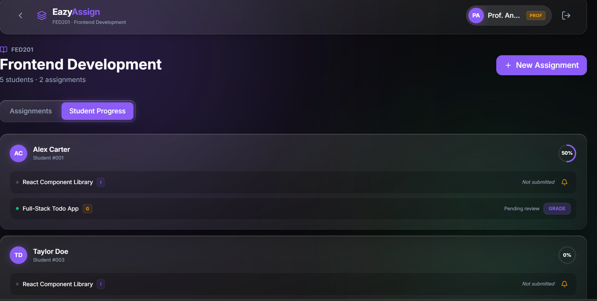
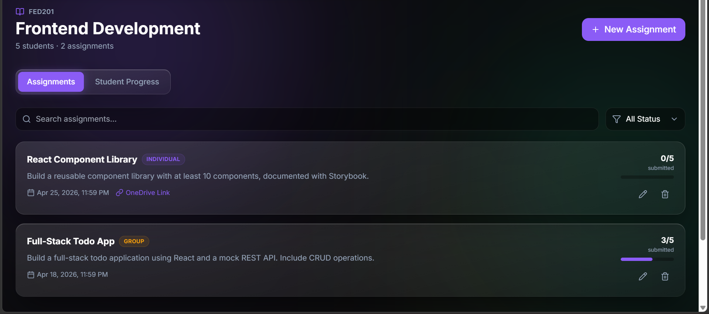
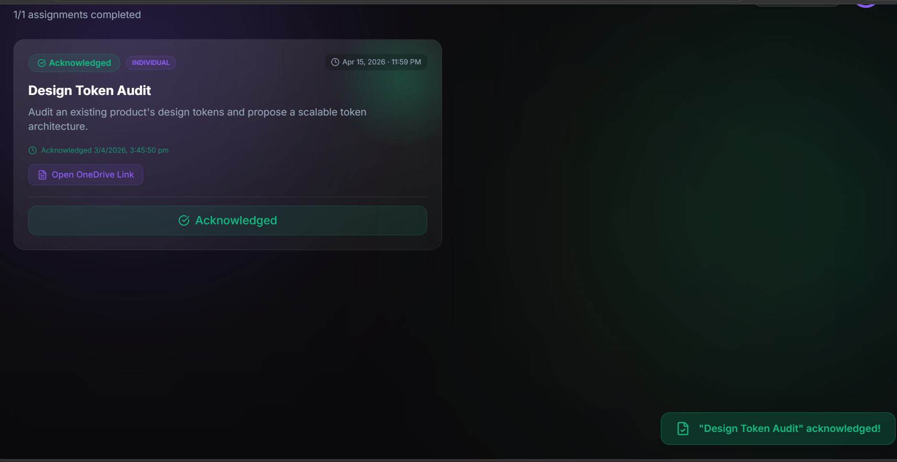
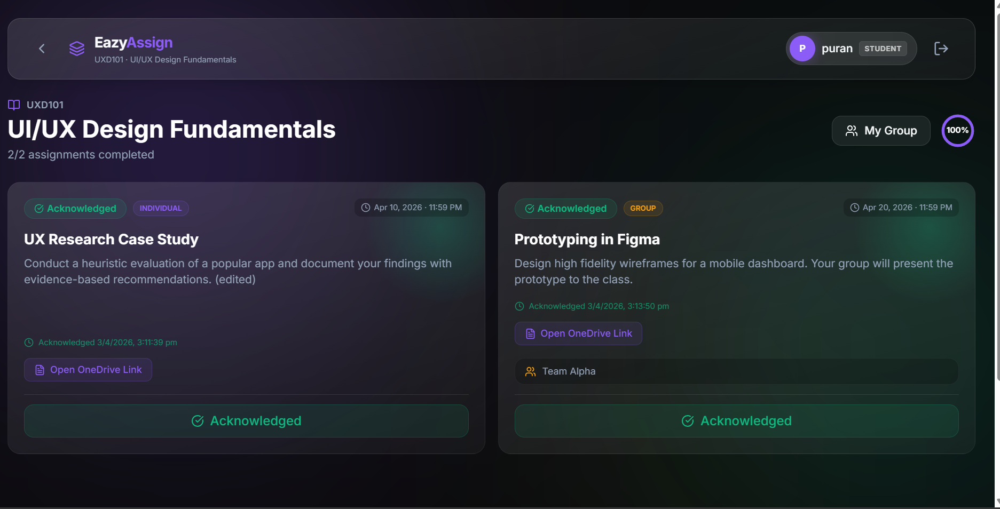

# Joineazy — Premium Educational SaaS 🎓



A **state-of-the-art educational management platform** built for modern classrooms. Joineazy simplifies student-professor collaboration through high-fidelity design, real-time activity tracking, and seamless group dynamics.

---

## 🎨 Frontend Design Choices

Joineazy was designed to mimic the "premium" feel of modern software tools like Linear, GitHub, and Framer. Key design decisions include:

### 1. **Visual Aesthetic: Dark Glassmorphism**
- **Depth and Layering**: Using semi-transparent `backdrop-blur` (glassmorphism) with subtle white borders (`border-white/5`) creates a sophisticated sense of hierarchy without heavy shadows.
- **Vibrant Design Tokens**: Eschewing generic colors for a custom, harmonious palette (Primary-Purple, Success-Emerald, Warning-Amber, Danger-Crimson) that flows through every badge, ring, and button.
- **Ambient Lighting**: Fixed background orbs (`bg-primary/20`) with large blur radii create a dynamic, "moving" atmosphere behind the static dashboard.

### 2. **User Experience (UX) Philosophy**
- **Action-Oriented Feed**: A real-time, chronological sidebar (Activity Feed) ensures users are never "lost" and can quickly resume their most recent tasks.
- **Confirmation Safety Barriers**: Destructive actions (Leaving a group, transferring leadership, deleting assignments) are gated behind elegant glassmorphic overlays to prevent accidental data loss.
- **Real-time Feedback**: Every action triggers a non-intrusive **Toast Notification** at the bottom-right for instant confirmation.

### 3. **Architecture & Performance**
- **Vite 8 + React 19**: Leveraging the fastest build tools and latest React reconciliation engine for near-instant cold starts and HMR.
- **Atomic Components**: Reusable, pure components for `ProgressRing`, `CourseCard`, and `AssignmentCard` that respond dynamically to data changes.
- **Simulated JWT Persistence**: A robust `localStorage` wrapper mirrors an enterprise-grade authentication flow, allowing full session persistence without a formal backend.

---

## 📸 Application Preview

### Core Dashboards
| Student Dashboard | Professor Dashboard |
| :---: | :---: |
|  |  |

### Group & Assignment Management
| Group Collaboration | Assignment Creation Flow |
| :---: | :---: |
|  |  |

### Student Progress & Tracking
| Student Progress View | Assignment Status |
| :---: | :---: |
|  |  |

### User Feedback & Experience
| Toast Notifications | Detailed Assignment View |
| :---: | :---: |
|  |  |

---

## 🚀 Setup Instructions

### Prerequisites
- **Node.js** v18.x or higher
- **npm** v9.x or higher

### Local Development
Follow these steps to get the project running on your machine:

1. **Clone the repository**:
   ```bash
   git clone https://github.com/Puranjaysalaria/Joineazy.git
   cd Joineazy
   ```

2. **Install dependencies**:
   ```bash
   npm install
   ```

3. **Start the development server**:
   ```bash
   npm run dev
   ```
   The application will be available at **http://localhost:5173**.

### Production Build
To generate a production-ready bundle:
```bash
npm run build
```
The output will be located in the `/dist` directory, ready to be hosted on Netlify, Vercel, or GitHub Pages.

---

## 🏗️ Component Structure

```text
src/
├── App.jsx             # Main router, Central state (DB), Layouts
├── components/
│   ├── Login           # Role-based entry with Student/Admin flows
│   ├── StudentDashboard# Enrolled courses, Activity Feed, Group CRUD
│   ├── ProfDashboard   # Create/Edit tasks, Student monitoring, Grading
│   ├── CourseCard      # High-fidelity shared visual container
│   ├── ProgressRing    # Dynamic SVG circular tracker
│   └── AssignmentCard  # Task-specific UI (Individual vs Group)
└── api/
    └── mockApi.js      # Async wrappers (mirroring real API latency)
```

---

## ✨ Features Highlight

### 🧑‍🎓 For Students
- **Dashboard Overview**: Circular progress tracking for all enrolled subjects.
- **Group Collaboration**: Join, Create, or Leave project teams with a dedicated dashboard panel.
- **Real-time Activity**: A scrolling audit log of all personal and group achievements.
- **Urgent Reminders**: Context-aware notification banners for upcoming deadlines.

### 🧑‍🏫 For Professors
- **Course Control**: Manage multiple subjects with student enrollment stats.
- **Assignment Studio**: Create Individual or Group tasks with OneDrive integration.
- **Progress Monitoring**: Batch-review all student submissions per assignment.
- **Feedback & Grading**: Direct grading interface with written feedback integration.

---

## 🔧 Deployment Details
- **Hosting**: Netlify/Vercel (configured with `_redirects` for SPA routing).
- **Environment**: Modern browsers with ES6+ support.
- **Repository**: [Joineazy on GitHub](https://github.com/Puranjaysalaria/Joineazy)

---

> Created with passion by **Puranjay Salaria**.
